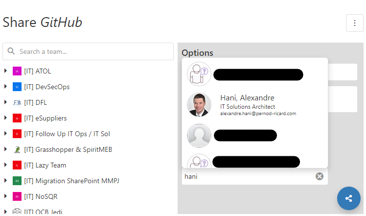
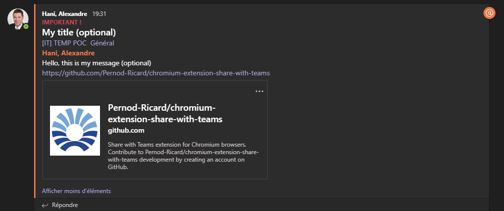

# Chromium extension : Share with Teams
*Share with Teams* is an extension for Chromium browsers that allows you to post a message in a Microsoft Teams channel about a web site.  

## Summary
* [External components](#external-components)
* [Usage](#usage)
* [Result in Microsoft Teams](#result)
* [Technical points](#technical-points)
  * [Automatic theming](#automatic-theming)
  * [Azure AD & Graph Api](#azuread-graphapi)

## <a id='external-components'>External components</a>
At first, note that following components are used in this extensions and are provided in this repository (so keep an eye on their license) :
* [DevExtreme Components for UI Controls and Themes](https://js.devexpress.com/)
* [jQuery](https://jquery.com/)
* [Unknown user icon from flaticon](https://www.flaticon.com/free-icon/beginners_2534338?term=unknown%20user&page=1&position=1)
* [Teams icon (by Icon Mafia on iconscout)](https://iconscout.com/icon/teams-1411850)
* [Share icon from flaticon](https://www.flaticon.com/free-icon/share_456299?term=share&page=1&position=44)

## <a id='usage'>Usage</a>
When the extension has been installed, the following option appears in the toolbar :  
  
  
Juste click on it to execute the extension. At the first launch the authentication must be opened, enter your organization credentials (work of school account).  

When yo are authenticated, the extension load your Teams frm Microsoft Graph Api :  
  

Note that the extension applies the same theme than your browser :  
  

Your teams and their channels are saved in the local storage (except the teams icons). These cached data are automatically cleaned and refeshed when you execute the extension after 10 days.  
You can force the refresh of your teams/channels through that option :  
  

To mention one or many of your colleagues, just enter the first letters of his last name or his email address. A search will be launched through Microsoft Graph Api and you will be able to select your colleague in the people picker :  
  

## <a id='result'>Result in Microsoft Teams</a>
**Note that all options in the right pane are optionals.**  
  
  
  

Unfortunately the Graph Api cannot create the preview that the Teams client application creates when youi share a link.  
And Graph Api doesn't allow us to create it...  

So the extension creates a Thumbnail Card to simulate that preview :  
  

## <a id='technical-points'>Technical points</a>

### <a id='automatic-theming'>Automatic theming</a>
Automatic theming is a great feature of the DevExpress components. Just add the corrects links in the head tag of your page ([see window.html](src/window.html)) then execute the following script (find it in [theme.js](src/scripts/theme.js)) :  
```javascript
if (window.matchMedia && window.matchMedia('(prefers-color-scheme: light)').matches) {
    DevExpress.ui.themes.current("generic.light");
} 
```  

More info about themes : [DevExtreme Predefined Themes](https://js.devexpress.com/Documentation/Guide/Themes_and_Styles/Predefined_Themes/)


### <a id='azuread-graphapi'>Azure AD &amp; Graph Api</a>
To be able to get the teams of a user, you need an Azure Active Directory application with the following Microsoft Graph permissions :  
* User.Read (sign in)  
* Group.ReadWrite.All (get teams and post a message)  

If you don't need to post a message, just add the Group.Read.All permission.  

Note that for the people picker, you will need the User.Read.All permission.